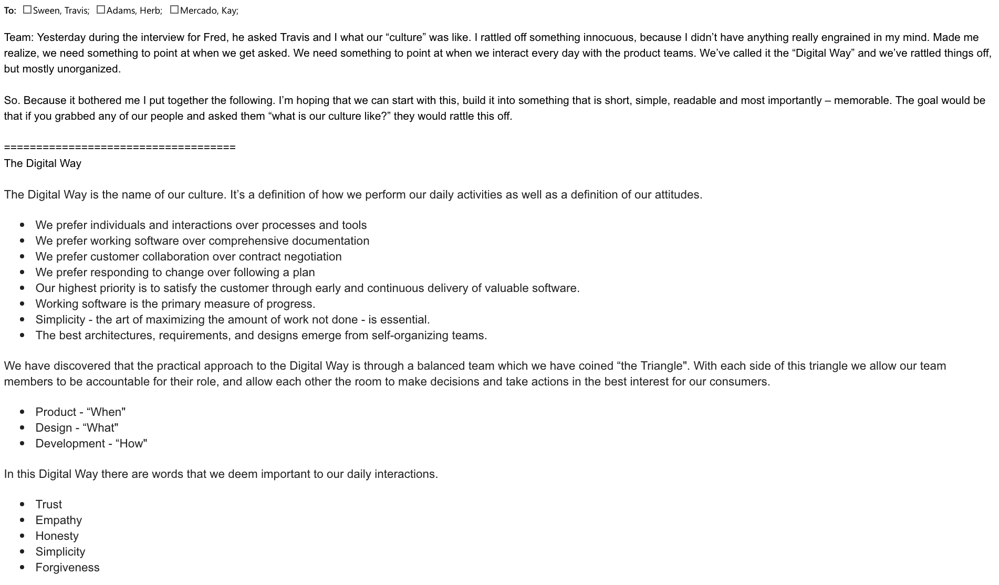

# Development Experience
#### The story of building a culture

---

# Origin Story
In the spring of 2015, CSAA Insurance Group's Digital Services team decided to
make a dramatic shift in it's culture, processes and development team.

This culture was based on **Developer Experience**.

- David Dollar
  - https://www.heavybit.com/library/video/developer-experience-design/
- Pivotal Labs
  - CSAA Insurance Group mobile application development project

It was our experience building a mobile app with Pivotal that we all decided
our organization needed to change.

---

# We'll do it live!!

We started pretty much right away and didn't plan any of it up front.

- Top down approval with immediate action - sort of
  - It was mostly just a Digital thing, the rest of the company was in the dark
  - This caused problems later
- Started with hiring interns and creating a "Development Experience" team
- Interns allowed us to practice
- But it was production level projects - not "proof of concept"

---
# Something was missing

We started organizationally, and operationally, but ...

- No one could articulate what exactly it was
- No one had stopped to call it a name and give it a description

---

# "What's your culture like?"

---

# DX culture

### 5 words we deem important
- Trust
- Honesty
- Simplicity
- Forgiveness
- Empathy

---

# DX philosophy

- "I don't know" is first position in every interaction
- Empathize before educating
- Simplest thing that works today
- Architecture is always JIT

_There were more but these were the winners_

---

# eXtreme Programming

- Best paradigm for honest, empathetic development
- Quickest path to building trust
- Simplicity is built-in

---

# Pair Programming

- Immediate education system
  - on-boarding is hours not days
  - knowledge gaps shrink
- Bad ideas die fast

---

# TDD

- Most effective way to trust ... yourself
- Deliverying everyday is a no consequence decision
- Take the religion out and the effect becomes stronger
- "show me it works"
- TDD increases the ability to change later without consequence

** consequences will deflate confidence **
---

# Balanced teams
- We called it the "triangle"
  - Product "When"
  - Design "What"
  - Development "How"
  - The user is always in the center of the triangle

---

# Everyone loved it!
Not entirely ...
- Took a while for devs to believe it
- Took a while for product/design/management to trust it
- Daily delivery was harder than anticipated (technically, organizationally)
- Developers panicked in a bunch of cases unnecessarily
- We fought over branching/merging the most and it was never the problem
  - Release times led to collisions (monolith problem)
  - Feature work led to collisions (prioritization problem)
- Lack of trust that everyone is doing their best
- Lack of honesty about confidence to do work against expectations
- Forgetting that this stuff is really hard
- Over estimating that "experts" could solve this quickly
- Never totally "correctly" handled failures (deadlines, goals etc)
- Still stuck on "prevent failure" vs. "fix failure fast"

---

# If I started today ...

- Commit to repeating myself everyday
- Negotiate with management for "proof of effectiveness"
- Silence is never acceptance - get feedback immediately
- Absolutely and unequivocally know your whole IT org

---

# First team, first activity

## Team
- at a minimum 1 pair
- don't fall for the "must be senior" fallacy
- include skeptics (requirement)

## Activity
- can be a simple feature or a whole product
- does not have to be user-facing deliverable
- don't conflate with re-write/refactor
- provide value - don't "proof of concept"

---

# Transparency all the way
- setup communication immediately
- educate everyone on the process/progress
- if outside stakeholders don't understand - you will lose

---

# Trust

### How to build it
- Deploy everyday - everything visual, anything else
- Completely and thoroughly communicate complexities
  - Tell how you've removed them
  - Tell how you're encountering them
  - Tell how you're working around them

### How to use
- Don't over think feature requests (just start work)
- Be a part of the feature design, not the "authority"
- Others have good ideas - listen

If you find yourself distrusting a teammate always start with this question:

*"What is best for the user?"*

---

# Empathy

### How to build it
- Be more honest about your feelings
- Imagine everyone is your favorite elder
- Never lie about your confidence to do new things
- Have faith that others feel the same way

### How to use it
- Always stop when you feel defensive
  - It's never about you
  - It's never (ever) about using React vs. Angular
- Do more than listen: Agree with your opposition on at least 2 things

---

# Honesty

### How to build it
- Ask emotion questions
  - "how do you feel about this"
  - "does this make you nervous"
  - "are you disappointed about this"
- Admit your own feelings

## How to use it
- Everyday admit to not knowing something (out loud)
- Allow yesterday's work to be dismissed, deleted and forgotten
- Allow others to be honest (don't resort to anger, frustration etc)

---

# Simplicity

- If the user doesn't benefit from it nobody cares
- Architecture only matters after you prove there is a problem
- Nothing lasts forever so design for "throw-away-ability"

---

# Forgiveness

- You are human
- So are your co-workers
- Get over yourself

---

# Final Thoughts

- Software is never done
- Nothing lasts forever
- The 5 words are hard - but the most rewarding part
- Culture (DX) does not mean everyone is happy everyday
