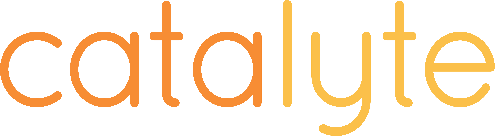

layout: true

.right[
.logo[]
]

---

# DX

## Development Experience

### _Software culture and philosophies_

---

# What exactly?

DX is a play on the official ISO Standard for UX (User Experience):

https://www.iso.org/obp/ui/#iso:std:iso:9241:-210:ed-1:v1:en

In short:

> "a person's perceptions and responses that result from the use or anticipated use of a product, system or service"

and:

> "includes all the users' emotions, beliefs, preferences, perceptions, physical and psychological responses, behaviors and accomplishments that occur before, during and after use. ..."

---

# DX is this ...

> "a developer's perceptions and responses that result from the use or anticipated use of a API, library or tool"

--

About building software ... are you ever really doing it alone?

--

So it's also this:

> " ... and interactions with others."

---

# Philosophy

> "Philosophy is the study of general and fundamental problems."

---

# DX philosophy

- "I don't know" is first position in every interaction (Socratic)
  - Zen mind, empty mind, beginners mind
    > "I don't know anything therefore I'm open to evertyhing"
- Empathize before educating - listen
- Simplest thing that works today
- Architecture is always JIT (Just In Time)
- Science is easy to find, look for the art

---

class: center, middle

# Industry practices

---

# eXtreme Programming

- Best paradigm for honest, empathetic development
- Quickest path to building trust
- Simplicity is built-in

---

# Pair Programming

- Immediate education system
  - on-boarding is in hours not days
  - knowledge gaps shrink
- Bad ideas die fast

---

# TDD

- Most effective way to trust ... yourself
- Deliverying everyday is a no consequence decision
- Immediate feedback loop
- Increases the ability to change without consequence
  - _consequences will deflate confidence_

---

# Culture

> "Culture is the social behavior and norms found in human societies."

---

# DX culture

### 5 words

- Trust
- Honesty
- Simplicity
- Forgiveness
- Empathy

---

# Trust

### How to build it

- Deploy everyday - everything visual and anything else
- Completely and thoroughly communicate complexities
  - Tell how you've removed them
  - Tell how you're encountering them or ignoring them

### How to use

- Don't over think requests (just start work)
- Be a part of the design, not the _authority_

Resolve trust issues with this question: _"What's best for the user?"_

---

# Empathy

### How to build it

- Be more honest about your feelings
- Imagine everyone is your favorite elder
- Never lie about your confidence to do new things
- Have faith that others feel the same way

### How to use it

- Always stop when you feel defensive
  - It's never about you
  - It's never (ever) about using React vs. Angular
- Do more than listen: Agree with your opposition on at least 2 things

---

# Honesty

### How to build it

- Ask emotion questions
  - "how do you feel about this"
  - "does this make you nervous"
  - "are you disappointed about this"
- Admit your own feelings

### How to use it

- Everyday admit to not knowing something (out loud)
- Allow yesterday's work to be dismissed, deleted and forgotten
- Allow others to be honest (don't resort to anger, frustration etc)

---

class: center, middle

# Honesty Warning

<iframe width="640" height="385" src="https://www.youtube.com/embed/C6BYzLIqKB8" frameborder="0" allow="encrypted-media" allowfullscreen></iframe>

---

# Simplicity

### Simple rules about simplicity:

- If the user doesn't benefit from it nobody cares
- Architecture only matters after you _prove_ there is a problem
- Nothing lasts forever so design for "throw-away-ability"
  - the new TDD!

---

# Forgiveness

- You are human
- So are your co-workers
- Get over yourself
- Let go of past grievances

---

class: center, middle

# Take a moment

---

### Humans are complicated

- We often identify ourselves with our works
- We have feelings and emotions that conflict with logic and reason
- We forget that this stuff is really hard

### Software is not real

- Show me where the software is?
- Do Photoshop devs "own" the users artwork?
- pulses of electricity ... on/off

Software therefore is not:

- our identity
- easy

---

# Final Thoughts

- Software is never done
- Nothing lasts forever
- The 5 words are hard - but the most rewarding part
- Actions make reality